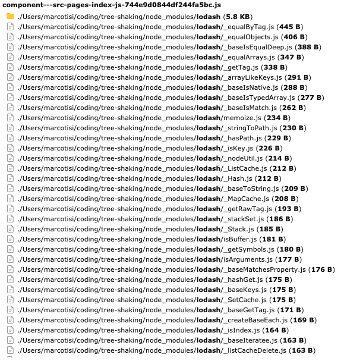

# Tree shaking experiment

This repository contains four different apps, two based on Gatsby and two based on CRA. Each framework has two different
examples, one that loads the full version of `lodash` and another example that only loads the needed libraries. Each
application has a page with a simple function that sums 1000 elements, but with `lodash`.

Here's the pure JavaScript code:

```js
const items = Array.from({
  length: 1000
}).map((_, index) => index);

const getTotal = (items) => items.reduce(items, (total, item) => {
  total += item
  return total
}, 0);
```

The goal is to compare the resulting bundles and see how tree shaking can reduce the final size.

## Code

### Tree shaking

```js
import reduce from "lodash/reduce"

const getTotal = (items) => reduce(items, (total, item) => {
  total += item
  return total
}, 0);
```

### No tree shaking

```js
import _ from "lodash"

const getTotal = (items) => _.reduce(items, (total, item) => {
  total += item
  return total
}, 0);
```

## Get started

Installing everything with `yarn`

```console
yarn install
```

Run the `build` script with `lerna`

```console
lerna run build --stream
```

## Results

### Gatsby

#### Tree shaking

<a href="./img/gatsby-tree-shaking.png" target="_blank"></a>

#### No tree shaking

<a href="./img/gatsby-no-tree-shaking.png" target="_blank"></a>

### CRA

#### Tree shaking

<a href="./img/cra-tree-shaking.png" target="_blank"></a>

#### No tree shaking

<a href="./img/cra-no-tree-shaking.png" target="_blank"></a>

## Conclusions

Gatsby seems to perform better and enforcing tree shaking even when importing the whole package.
CRA doesn't enforce tree shaking so remember to import only the needed modules.
